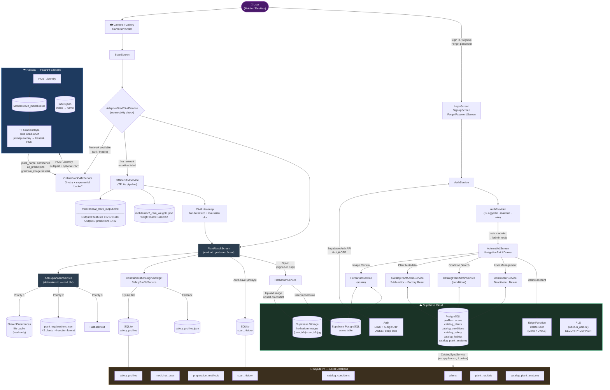

# HerbaScan – System Architecture & Product Requirements Document

> **Version:** v0.9.5 · **Date:** March 16, 2026 · **Status:** Production-Ready (Thesis Phase)
> **Revised** to reflect CHANGELOG through March 2026.
>
> **Source of Truth Hierarchy:** This document is derived from `CHANGELOG.md` as the absolute authority.
> Any README or setup guide that contradicts the Changelog (e.g., mentions of the Gemini live LLM or the
> deprecated HerbaScan custom model) has been resolved in favour of the Changelog.

---

## Table of Contents

1. [Executive Summary](#1-executive-summary)
2. [Core Features & Business Logic](#2-core-features--business-logic)
  - 2.1 Feature Inventory
  - 2.2 Offline-First Sync Strategy
  - 2.3 Hybrid XAI Explanation System (No-LLM)
  - 2.4 Admin Portal
  - 2.5 UI/UX Redesign (March 2026)
3. [System Architecture](#3-system-architecture)
  - 3.1 Flutter Frontend Layer
  - 3.2 Python FastAPI Backend (Railway)
  - 3.3 Supabase Cloud Layer
  - 3.4 SQLite Local Layer
  - 3.5 Asset Bundle
4. [Architecture Diagram](#4-architecture-diagram)
5. [ML Pipeline & Data Flow](#5-ml-pipeline--data-flow)
6. [Deployment & Infrastructure](#6-deployment--infrastructure)
7. [Known Constraints & Open Items](#7-known-constraints--open-items)

---

## 1. Executive Summary

**HerbaScan** is an AI-powered Flutter mobile application designed to identify Philippine medicinal plants from photos using a MobileNetV2 Convolutional Neural Network. It is developed as an undergraduate thesis at Lyceum of the Philippines University-Cavite (CITE) in partnership with the Philippine Institute of Traditional and Alternative Health Care (PITAHC).

### Primary Purpose

The application serves communities—particularly in rural areas with limited connectivity—by:

- **Identifying** 42 medicinal plant species (10 DOH-approved + 32 additional) from a camera or gallery image.
- **Explaining** the AI's reasoning through Explainable AI (XAI) heatmaps (Grad-CAM online / CAM offline).
- **Informing** users with structured, deterministic plant knowledge (taxonomy, ecology, medicinal preparation, safety profile).
- **Empowering** researchers and administrators through a cloud-backed admin portal for dataset building and plant catalog management.

### Current Production State (v0.9.5 – March 2026)


| Dimension            | State                                                                             |
| -------------------- | --------------------------------------------------------------------------------- |
| **Overall progress** | ~90% — all core features implemented; beta testing pending                        |
| **AI Model**         | MobileNetV2-only (HerbaScan custom model deprecated in Phase 34)                  |
| **XAI Explanations** | Fully deterministic — no live LLM at runtime (Gemini removed in CHANGELOG)        |
| **Plant Database**   | 42 medicinal plants, all migrated to structured 4-section format (Phase 35)       |
| **Cloud Backend**    | FastAPI on Railway (`re-herbascan-production.up.railway.app`) — Grad-CAM provider |
| **Auth & Cloud DB**  | Supabase (Auth, PostgreSQL, Storage, Edge Functions)                              |
| **Local DB**         | SQLite v8 (8 tables), offline-first with Supabase sync                            |
| **Admin Portal**     | Full Flutter AdminWebScreen on all platforms via GoRouter `/admin`                |


---

## 2. Core Features & Business Logic

### 2.1 Feature Inventory

#### Scan & Identification


| Feature                               | Status | Notes                                                                                                                |
| ------------------------------------- | ------ | -------------------------------------------------------------------------------------------------------------------- |
| Camera capture + pinch-to-zoom        | ✅      | Real device only                                                                                                     |
| Gallery image selection               | ✅      |                                                                                                                      |
| Online Grad-CAM (Railway)             | ✅      | True gradient-based heatmap                                                                                          |
| Offline CAM (TFLite)                  | ✅      | Bicubic interpolation + Gaussian blur                                                                                |
| Adaptive fallback (online → offline)  | ✅      | `AdaptiveGradCAMService`                                                                                             |
| Top-3 predictions with confidence %   | ✅      |                                                                                                                      |
| Full-screen tap-to-expand plant image | ✅      | Hero animation + pinch-to-zoom                                                                                       |
| Full-screen heatmap mode              | ✅      | Zoomable, live opacity controls                                                                                      |
| Scan history (Device tab)             | ✅      | SQLite `scan_history`                                                                                                |
| Scan history (Cloud tab)              | ✅      | Supabase `scans` table, swipe + pull-to-refresh                                                                      |
| Cloud save (Personal Herbarium)       | ✅      | Opt-in when signed in, upsert on duplicate                                                                           |
| Heatmap in cloud sync                 | ✅      | Upload stores heatmap as `{scan_id}_gradcam.jpg` in Storage; metadata `gradcam_url`; download restores `gradCAMPath` |
| Toxic plant blacklist (app-layer)     | ✅      | When top prediction is Adelfa, Ipil-Ipil, or Tuba-Tuba, dedicated warning screen; no normal result or auto-save. Source: `toxic_plant_blacklist.dart`. |


#### Plant Knowledge


| Feature                                 | Status | Notes                                        |
| --------------------------------------- | ------ | -------------------------------------------- |
| 42-plant database                       | ✅      | 10 DOH-approved + 32 additional              |
| Plant Detail screen (4 tabs)            | ✅      | Taxonomy / Ecology / Medicinal / Safety      |
| Interactive 2D plant silhouette         | ✅      | SVG path hit-testing, DB-backed anatomy data |
| Static habitat heatmap (OSM)            | ✅      | `flutter_map` + curated coordinates          |
| Preparation guide (interactive)         | ✅      | Checklist, contextual timers, Focus Mode     |
| Calendar add-to-device                  | ✅      | Android `ACTION_INSERT` intent               |
| Contraindication Engine                 | ✅      | Deterministic — `safety_profiles.json`; optional `needs_strict_contraindications` for prominent "Use with strict caution" card |
| Extended plant anatomy (39 non-toxic)   | ✅      | `default_plant_anatomy.json`; seed from defaults via Admin; 3 toxic plants excluded (adelfa, ipil-ipil, tuba-tuba) |
| Condition-based search (15+ conditions) | ✅      | DB-backed, admin-manageable                  |
| Browse / search / grid / list view      | ✅      |                                              |
| DOH Approved Plants screen              | ✅      |                                              |


#### Auth & Account


| Feature                                  | Status | Notes                                           |
| ---------------------------------------- | ------ | ----------------------------------------------- |
| Email + password sign-up                 | ✅      |                                                 |
| 6-digit OTP signup confirmation          | ✅      |                                                 |
| 6-digit OTP password reset               | ✅      | Bulletproof; avoids link-scanner issue          |
| Change password (with live requirements) | ✅      |                                                 |
| Change email                             | ✅      |                                                 |
| Delete account                           | ✅      | Calls `delete-user` Edge Function               |
| RBAC (user / admin)                      | ✅      | `profiles.role` + `is_admin()` SECURITY DEFINER |
| Friendly auth error messages             | ✅      |                                                 |


#### Settings & Offline


| Feature                         | Status | Notes                                                                      |
| ------------------------------- | ------ | -------------------------------------------------------------------------- |
| Offline mode toggle             | ✅      | `OfflineProvider` ↔ `AppProvider` sync                                     |
| Offline storage info + refresh  | ✅      |                                                                            |
| Clear offline data              | ✅      | Wipes device scan history                                                  |
| Persistent user preferences     | ✅      | `SharedPreferences`                                                        |
| English / Filipino localization | ✅      |                                                                            |
| System Diagnostics              | ✅      | Renamed from Offline Demo; 2×2 stat cards, connection banner               |
| De-jargonified AI labels        | ✅      | e.g. "Show Prediction Confidence", "Show AI Reasoning Heatmap" in Settings |


#### Admin Portal (all platforms)


| Feature                                    | Status | Notes                                                                                                                 |
| ------------------------------------------ | ------ | --------------------------------------------------------------------------------------------------------------------- |
| Image Review (Pending / All)               | ✅      | Approve / Reject / Delete submissions                                                                                 |
| Plant Metadata editor (6-tab form)         | ✅      | Cloud-first, syncs to SQLite. Tabs: Identity, Ecology, Medicinal, Preparations, Safety, **Anatomy**. **Anatomy** (sixth tab): list/add/edit 2D silhouette parts; default entries from `default_plant_anatomy.json` (Restore to Default, delete protection). Consumer: Plant Detail → Medicinal → "Explore Plant Parts" supports **multi-part carousel** (PageView) when a plant has multiple anatomy parts. |
| Editable safety + habitat tabs             | ✅      | Writes to Supabase `catalog_safety` / `catalog_habitat`                                                               |
| Full medicinal uses + preparations editors | ✅      |                                                                                                                       |
| Condition Search management                | ✅      | Add / edit / delete custom conditions + plant mapping                                                                 |
| User Management                            | ✅      | **ListTile** row: title (email + role badge), subtitle (Joined date • scan count); admin avatar/badge use **AppTheme.botanicalPrimary** + white in light mode for contrast. **Make admin / Remove admin** via `AdminUserService.setRole(userId, role)` (no migration). **Force activate email** (OTP bypass) via Edge Function `force-verify-user`. Deactivate, delete; trailing status dot + PopupMenuButton. |
| Factory Reset                              | ✅      | Re-seeds 42 plants, safety, habitat, conditions to Supabase                                                           |
| 2D Silhouette admin seed                   | ✅      | `catalog_plant_anatomy` insert templates                                                                              |
| Instant local sync                         | ✅      | After catalog/condition/plant save, admin triggers local SQLite sync so browse/detail see changes without app restart |
| Condition list plant count                 | ✅      | Admin "X plants" matches browse (same two-step logic: explicit mappings then keyword fallback)                        |


---

### 2.5 UI/UX Redesign (March 2026)

The following reflects the CHANGELOG UI/UX redesign (design system and screen-by-screen updates).

**Design system:** `AppTheme` in `lib/core/theme/app_theme.dart`; Indigo→Emerald pivot; botanical primary (`#16A34A`), dark surfaces (Forest Black, slate-green), semantic colors (safe/warning/error).

**Navigation:** 4 tabs (Home, Browse, History, Settings) + center camera FAB; DOH Approved Plants accessed via Home carousel "See All" (no DOH tab in bottom nav).

**Key screen changes:**


| Screen                         | Changes                                                                                                                                       |
| ------------------------------ | --------------------------------------------------------------------------------------------------------------------------------------------- |
| Splash                         | Solid background (`surfaceColor`/`darkScaffold`), linear progress bar, eco icon                                                               |
| Onboarding                     | De-jargonified copy, single botanical palette, Skip top-right, FilledButton                                                                   |
| Home                           | BottomAppBar, center FAB, stats ribbon, Recent Scans horizontal scroll, DOH Spotlight carousel                                                |
| Browse                         | SearchBar (Material 3), SegmentedButton All/DOH, "Search by Medical Condition" banner                                                         |
| Scan                           | Edge-to-edge camera, corner-bracket reticle, glassmorphic controls, tips bottom sheet                                                         |
| Plant Result                   | Insights + AI Vision tabs; glassmorphic hero, Save/Share over image; no nested Heatmap/Summary sub-tabs                                       |
| Plant Detail                   | SliverAppBar hero, Quick Facts card, taxonomy 2×2 grid, medicinal cards, safety tab                                                           |
| History                        | TabBar in SliverAppBar, device cards (thumbnail + confidence pill), select mode, swipe export/delete, batch Sync/Download, heatmap from cloud |
| Settings                       | Grouped cards (Account, App Preferences, Scanning & AI, Support, Developer Options)                                                           |
| DOH                            | Compact disclaimer banner, grid cards with glassmorphic DOH badge                                                                             |
| Help                           | Disclaimer banner, best-practices carousel, FAQ accordion                                                                                     |
| Auth/OTP                       | Botanical header widget, pinput 6-box OTP, password requirements micro-pills                                                                  |
| Condition Search               | Directory grid; tap opens ConditionResultsScreen                                                                                              |
| Habitat Map                    | Edge-to-edge map, floating back/zoom, DraggableScrollableSheet info panel                                                                     |
| Preparation Guide / Focus Mode | Warnings at top, checklist, contextual timers, FAB for Focus Mode                                                                             |
| System Diagnostics             | Renamed from Offline Demo; 2×2 stat cards, connection banner, Force Sync / Wipe Cache                                                         |


**Save/export:** Save to device/cloud and export from **Plant Result screen** only (and History device card export to gallery). Batch sync/download in History select mode; Select all / Deselect all.

---

### 2.2 Offline-First Sync Strategy

HerbaScan uses a **dual-database architecture**: Supabase PostgreSQL as the cloud master, SQLite v7 as the device-local store.

#### Sync Flow (Supabase → SQLite)

```
App Launch (PlantProvider._initializeData)
  └─ Connectivity check (connectivity_plus)
       ├── ONLINE → CatalogSyncService.syncFromSupabase()
       │     ├── Fetch catalog_plants → DatabaseService.replacePlantFromSync()
       │     ├── Fetch catalog_medicinal_uses → replace per plant
       │     ├── Fetch catalog_preparation_methods → replace per plant
       │     ├── Fetch catalog_safety → DatabaseService.replaceSafetyFromSync()
       │     ├── Fetch catalog_habitat → DatabaseService.replaceHabitatFromSync()
       │     ├── Fetch catalog_conditions → DatabaseService.replaceConditionsFromSync()
       │     └── Fetch catalog_condition_plants → replaceConditionPlantsFromSync()
       │
       └── OFFLINE → Serve all data from SQLite only (full feature set)
```

**Key design decisions:**

- **Idempotent writes:** All sync methods use `ConflictAlgorithm.replace` and delete child rows before re-inserting, preventing UNIQUE constraint failures on concurrent refreshes.
- **Offline-first data access:** Safety → SQLite first, fall back to `safety_profiles.json`; Habitat → SQLite first, fall back to `plant_habitats.json`; Conditions → SQLite first, fall back to 15 hardcoded defaults.
- **Fresh install protection:** `_ensureCatalogTablesExist()` runs in `onOpen` callback — all catalog tables are created if missing, so existing installs get schema updates without data loss.
- **Plant catalog is immutable to app users:** Only admins can edit catalog content via the admin portal. Adding a new plant class requires a model retrain and app release (enforced by design, not code).

---

### 2.3 Hybrid XAI Explanation System (No-LLM)

> **CRITICAL:** The Gemini API live LLM was **completely removed** from the system (CHANGELOG, "No live LLM – thesis defensibility"). No generative AI runs at runtime. `gemini_api_service.dart` and `gemini_plant_service.dart` no longer exist. `ConfigService` retains no Gemini key methods.

#### Explanation Resolution Chain (`XAIExplanationService`)

```
identifyPlant() triggers explanation lookup:

  Priority 1 → SharedPreferences / file cache  (read-only; previously saved from old online calls)
  Priority 2 → assets/data/plant_explanations.json  (42 plants, bundled in APK)
  Priority 3 → Hardcoded fallback text
```

#### Standardized 4-Section Structure (Phase 35 – all 42 plants)

Each plant explanation in `plant_explanations.json` follows this canonical schema:

```json
{
  "taxonomy":              "Family, Genus, Species (Markdown with hard line breaks)",
  "ecology":               "Habitat, growth patterns, distribution",
  "medicinal_preparation": "Traditional uses, preparation steps, dosage",
  "safety_consideration":  "Toxicity, look-alike warnings, contraindications"
}
```

Rendered in the app as `PlantExplanation` with `formattedExplanation` producing `### Taxonomy`, `### Ecology & Habitat`, `### Medicinal Uses`, `### Safety Protocol` Markdown sections.

#### Contraindication Engine (deterministic safety)

`SafetyProfileService` loads from `assets/data/safety_profiles.json` (SQLite first if synced):


| Field                      | Type | Purpose          |
| -------------------------- | ---- | ---------------- |
| `is_generally_safe`        | bool | Green card in UI |
| `pregnancy_warning`        | bool | Red warning card |
| `known_side_effects`       | list | Yellow card      |
| `drug_interactions`        | list | Orange card      |
| `strict_contraindications` | list | Red card         |
| `needs_strict_contraindications` | bool | When true, prominent orange "Use with strict caution" card shown at top (e.g. Kamias, Kamoteng Kahoy, Kakawate) |


The `ContraindicationEngineWidget` renders these deterministically on the Plant Detail Safety tab and the PlantResult Summary tab with no network calls.

---

### 2.4 Admin Portal

The Admin Portal is a **fully integrated Flutter feature** accessible on all platforms (Android, Windows desktop, web) via GoRouter route `/admin` (protected by auth + role guard). It renders as:

- **Wide screen (≥ 800px):** `NavigationRail` sidebar with 6 modules (Image Review, Plant Metadata, Condition Search, User Management, System Health, Feedback).
- **Narrow screen:** Drawer with gradient header and the same 6 destinations.

#### Auth Guard (GoRouter redirect)

```dart
if (loc == '/admin') {
  if (!auth.isLoggedIn) return '/login';
  await auth.refreshRole();
  if (!auth.isAdmin) return '/home?unauthorized=1';
}
```

#### Admin Modules


| Module                        | Service                    | Supabase Tables                                                                                                                         |
| ----------------------------- | -------------------------- | --------------------------------------------------------------------------------------------------------------------------------------- |
| Image Review                  | `HerbariumService`         | `scans`, `storage.objects`                                                                                                              |
| Plant Metadata (6-tab editor) | `CatalogPlantAdminService` | `catalog_plants`, `catalog_medicinal_uses`, `catalog_preparation_methods`, `catalog_safety`, `catalog_habitat`, `catalog_plant_anatomy` |
| Condition Search              | `CatalogPlantAdminService` | `catalog_conditions`, `catalog_condition_plants`                                                                                        |
| User Management               | `AdminUserService`         | `profiles`                                                                                                                              |
| Feedback                       | `FeedbackService`          | `user_feedback` (getFeedbackFromSupabase, deleteFeedbackFromSupabase; RLS DELETE admins only)                                           |


**System Health** (5th nav) replaced the former Performance Metrics and Performance Dashboard screens; it is the single admin-only destination for AI model stats, live usage, error logs, and export/clear. **Feedback** (6th nav) loads from `FeedbackService.getFeedbackFromSupabase()`; Option B stores submissions in Supabase when configured.

**System Health** and **Feedback** are content-only panels: they do not use an inner `Scaffold` or `AppBar`; each returns a single root (e.g. `RefreshIndicator` with scrollable content and an inline title + refresh). This avoids a nested Scaffold and rogue back button when rendered inside the host Admin shell. The **Admin Console** header (narrow/mobile layout) uses `theme.colorScheme.surface` and `theme.colorScheme.onSurface` so it adapts in dark mode. The **User Feedback** card is redesigned with a header row (category pill, stars, timestamp, overflow menu), user line, divider, comment in a quote-style container, optional suggestion line, and theme-consistent metadata chips; admins can delete entries via the card menu (requires RLS policy from migration `20260316000001_user_feedback_admin_delete.sql`). On narrow screens the header timestamp uses `Expanded` with `TextOverflow.ellipsis` and `maxLines: 1` to avoid overflow; the category pill uses `AppTheme.primaryDark` in light mode for readable contrast (dark mode uses `onPrimaryContainer`).

**Contextual feedback bottom sheet (“Did we get this right?”):** Validation SnackBars (e.g. “Please select feedback category”, “Please provide at least 10 characters”) are shown inside the sheet by wrapping sheet content in `ScaffoldMessenger` and `Scaffold` so messages appear above the Submit button and remain visible with the keyboard open. Sheet uses `keyboardDismissBehavior: manual` so the user can scroll without dismissing the keyboard; the Send feedback button is fixed outside the scroll view; when the keyboard is open the sheet uses full height above the keyboard (`size.height - viewInsets.bottom`).

#### Edge Functions

**delete-user**

- **Runtime:** Deno, deployed via `npx supabase functions deploy delete-user`.
- **JWT:** Gateway verification disabled (`supabase/config.toml`: `verify_jwt = false`); the function verifies internally via JWKS (Supabase asymmetric signing).
- **Self-delete:** No body → deletes caller's account.
- **Admin delete:** Body `{ "user_id": "<uuid>" }` → verifies caller is admin, deletes target.

**force-verify-user**

- **Purpose:** Admins can force-activate a user's email (set `email_confirmed_at`) so the user can sign in without completing OTP.
- **Deploy:** `npx supabase functions deploy force-verify-user`.
- **Config:** `supabase/config.toml`: `[functions.force-verify-user] verify_jwt = false`; function verifies caller is admin via `profiles.role` and sets target user's `email_confirmed_at` via Auth Admin API.
- **App:** **AuthService** `adminForceVerifyUser(String targetUserId)`; **AdminUserService** `forceVerifyUser(String userId)`. Admin → User Management: "Force activate email" menu item; if function not deployed, SnackBar with deploy command.

---

## 3. System Architecture

```
┌─────────────────────────────────────────────────────────────────────┐
│                     USER DEVICE (Android)                           │
│                                                                     │
│  ┌──────────┐  ┌──────────────────────────────────────────────┐    │
│  │ Flutter  │  │              Feature Screens                 │    │
│  │  main()  │  │  Splash · Home · Scan · Browse · History     │    │
│  │          │  │  Settings · Admin · Help · DOH · Dashboard   │    │
│  │ GoRouter │  └──────────────────┬───────────────────────────┘    │
│  └────┬─────┘                     │                                 │
│       │                    ┌──────▼──────┐                          │
│       │                    │  Providers  │                          │
│       │                    │  App · Auth │                          │
│       │                    │  Plant · Cam│                          │
│       │                    │  Language   │                          │
│       │                    │  Offline    │                          │
│       │                    └──────┬──────┘                          │
│       │                           │                                 │
│  ┌────▼───────────────────────────▼────────────────────────────┐   │
│  │                         Core Services                        │   │
│  │                                                              │   │
│  │  AdaptiveGradCAMService                                      │   │
│  │    ├─ OnlineGradCAMService  ──────────────────────────────┐ │   │
│  │    └─ OfflineCAMService ◄─ mobilenetv2_multi_output.tflite│ │   │
│  │                         ◄─ mobilenetv2_cam_weights.json    │ │   │
│  │                                                            │ │   │
│  │  XAIExplanationService ◄─ plant_explanations.json (42)    │ │   │
│  │  SafetyProfileService  ◄─ safety_profiles.json / SQLite   │ │   │
│  │  HabitatService        ◄─ plant_habitats.json / SQLite    │ │   │
│  │  ConditionService      ◄─ SQLite / defaults               │ │   │
│  │                                                            │ │   │
│  │  AuthService ◄─────────────────────────────────────────┐  │ │   │
│  │  HerbariumService ◄──────────────────────────────────┐ │  │ │   │
│  │  CatalogSyncService ◄────────────────────────────┐   │ │  │ │   │
│  │  CatalogPlantAdminService ◄────────────────────┐ │   │ │  │ │   │
│  │  AdminUserService ◄──────────────────────────┐ │ │   │ │  │ │   │
│  └──────────────────────────────────────────────┼─┼─┼───┼─┼──┼─┘   │
│                                                 │ │ │   │ │  │ │    │
│  ┌────────────────────────────┐                 │ │ │   │ │  │ │    │
│  │    SQLite v7 (Local DB)    │                 │ │ │   │ │  │ │    │
│  │  plants                    │                 │ │ │   │ │  │ │    │
│  │  medicinal_uses            │                 │ │ │   │ │  │ │    │
│  │  preparation_methods       │◄────────────────┘ │ │   │ │  │ │    │
│  │  scan_history              │  CatalogSyncService│ │   │ │  │ │    │
│  │  catalog_conditions        │                   │ │   │ │  │ │    │
│  │  safety_profiles           │                   │ │   │ │  │ │    │
│  │  plant_habitats            │                   │ │   │ │  │ │    │
│  │  catalog_plant_anatomy     │                   │ │   │ │  │ │    │
│  └────────────────────────────┘                   │ │   │ │  │ │    │
└───────────────────────────────────────────────────┼─┼───┼─┼──┼─┘   │
                                                    │ │   │ │  │ │
                ┌───────────────────────────────────▼─┼───▼─┼──▼─┘
                │          SUPABASE CLOUD              │     │
                │                                      │     │
                │  Auth (Email + 6-digit OTP)          │     │
                │  profiles · scans                    │     │
                │  catalog_plants + relations          │     │
                │  catalog_conditions/_plants          │     │
                │  catalog_plant_anatomy               │     │
                │  Storage: herbarium-images           │     │
                │  Edge Fn: delete-user, force-verify-user (Deno/JWKS) |     │
                │  RLS via is_admin() SECDEF           │     │
                └──────────────────────────────────────┘     │
                                                             │
                         ┌───────────────────────────────────▼──┐
                         │     RAILWAY (Python FastAPI)           │
                         │                                        │
                         │  GET  /health                          │
                         │  GET  /test                            │
                         │  POST /identify  (multipart/form-data) │
                         │    → MobileNetV2_model.keras           │
                         │    → TF GradientTape Grad-CAM          │
                         │    → labels.json (index→name)          │
                         │    → base64 heatmap PNG in response    │
                         └────────────────────────────────────────┘
```

---

### 3.1 Flutter Frontend Layer

#### Entry & Bootstrap (`lib/main.dart`)

1. `WidgetsFlutterBinding.ensureInitialized()`
2. Desktop SQLite FFI init (Windows/Linux/macOS via conditional import)
3. `Supabase.initialize(url, anonKey)` — guarded by `isSupabaseConfigured`
4. `PerformanceMonitor` app-start timer
5. Portrait orientation lock (mobile only)
6. `runApp(HerbaScanApp())` → `MultiProvider` (6 providers) → `AuthDeepLinkHandler` → `MaterialApp.router` (GoRouter)

#### State Management — 6 Providers


| Provider           | Responsibility                                                              |
| ------------------ | --------------------------------------------------------------------------- |
| `AppProvider`      | Theme, language, offline mode toggle, app-wide preferences; **auto-save scans** preference (`_autoSaveScans`, default true), persisted with key `'auto_save_scans'` in SharedPreferences; getter `autoSaveScans`, `toggleAutoSaveScans()`. Plant result screen gates automatic save on this preference. |
| `AuthProvider`     | Supabase session, user role (`user` / `admin`), sign-in/out/OTP flows       |
| `PlantProvider`    | Plant catalog (42 plants), scan history, anatomy data, catalog sync trigger |
| `CameraProvider`   | Camera init, capture, gallery selection, zoom controls (skipped on desktop) |
| `LanguageProvider` | English / Filipino localization, runtime switching                          |
| `OfflineProvider`  | Connectivity monitoring (`connectivity_plus`), offline mode, sync state     |


#### Routing (GoRouter — `lib/core/routing/app_router.dart`)


| Route         | Screen             | Guard              |
| ------------- | ------------------ | ------------------ |
| `/`           | `SplashScreen`     | None               |
| `/login`      | `LoginScreen`      | None               |
| `/home`       | `HomeScreen`       | None               |
| `/onboarding` | `OnboardingScreen` | None               |
| `/admin`      | `AdminWebScreen`   | Login + admin role |


> **Note:** `HomeScreen` receives `showUnauthorizedSnackBar` query param when redirected from `/admin` without admin role.

#### Key Service Dependencies

```
CameraProvider
  └─ AdaptiveGradCAMService
       ├─ OnlineGradCAMService  ──► Railway POST /identify
       │    └─ Supabase JWT (optional, from currentSession.accessToken)
       └─ OfflineCAMService
            ├─ TflitePlantService (mobilenetv2_multi_output.tflite)
            └─ CAM weights (mobilenetv2_cam_weights.json)

PlantProvider
  ├─ DatabaseService (SQLite)
  ├─ DatabaseInitService (seeds from PlantDataService on first run)
  └─ CatalogSyncService (Supabase → SQLite on network available)

AuthProvider
  └─ AuthService ──► Supabase Auth

HerbariumService ──► Supabase Storage + scans table
```

**Additional core services (admin / anatomy):**

- **DefaultAnatomyService:** Reads `assets/data/default_plant_anatomy.json` (key: plant_id|part_name); exposes `isDefault(plantId, partName)` and `getDefaultData(plantId, partName)` for Admin Anatomy tab "Restore to Default" and delete protection.
- **CatalogPlantAdminService:** Anatomy methods: `getCatalogAnatomyForPlant`, `insertCatalogAnatomy`, `updateCatalogAnatomy`, `deleteCatalogAnatomy`.
- **DatabaseService:** `replaceAnatomyForPlantFromSync(plantId, rows)` for single-plant anatomy sync after admin Anatomy edits.

---

### 3.2 Python FastAPI Backend (Railway)

**Location:** `backend/` · **URL:** `https://re-herbascan-production.up.railway.app`

#### Endpoints


| Method | Path        | Auth         | Description                                            |
| ------ | ----------- | ------------ | ------------------------------------------------------ |
| `GET`  | `/`         | None         | API info + model status                                |
| `GET`  | `/health`   | None         | `{ status, model_loaded, labels_loaded, num_classes }` |
| `GET`  | `/test`     | None         | Debug/connectivity check                               |
| `POST` | `/identify` | Optional JWT | Plant identification + Grad-CAM                        |


#### `/identify` Request / Response

**Request:** `multipart/form-data` with field `file` (JPEG/PNG image)  
**Optional Header:** `Authorization: Bearer <Supabase access token>`

**Response:**

```json
{
  "plant_name":      "Vitex negundo",
  "scientific_name": "Vitex negundo",
  "confidence":      0.942,
  "all_predictions": [
    { "class": "4Vitex negundo(VN)", "class_index": 34, "confidence": 0.942 },
    { "class": "6Blumea balsamifera(BB)", "class_index": 36, "confidence": 0.123 }
  ],
  "gradcam_image":       "<base64-encoded PNG>",
  "method":              "grad-cam",
  "processing_time_ms":  3456.78,
  "is_toxic":            true
}
```

**Optional field `is_toxic`:** When the top prediction class index is in `TOXIC_CLASS_INDICES` (0, 14, 39 — Adelfa, Ipil-Ipil, Tuba-Tuba), the backend may include `"is_toxic": true` in the response. The app-layer blacklist (`toxic_plant_blacklist.dart`) remains the primary authority; offline and older backends without this field remain safe.

#### JWT Behaviour (`SUPABASE_JWT_SECRET` env var)


| Scenario                                    | Behaviour                                    |
| ------------------------------------------- | -------------------------------------------- |
| `SUPABASE_JWT_SECRET` not set (recommended) | All requests allowed (anonymous + signed-in) |
| Set, no Bearer header                       | Request allowed (anonymous scan)             |
| Set, valid Bearer token                     | Request allowed                              |
| Set, invalid/expired Bearer token           | 401 returned                                 |


**Recommendation from `supabase/README.md`:** Leave `SUPABASE_JWT_SECRET` unset to prevent 401 errors for anonymous users.

#### Model Loading

1. Loads `models/MobileNetV2_model.keras` on `@app.on_event("startup")`.
2. Loads `models/labels.json` (format: `{ "0": "Adelfa", "1": "Akapulko", … "41": "YerbaBuena" }`).
3. If model file missing → server starts but `/identify` returns 503.

#### Grad-CAM Computation (`utils/gradcam.py`)

1. Preprocess image to `(224, 224, 3)` via `utils/preprocessing.py`.
2. Build sub-model up to last convolutional layer (`Conv_1` in MobileNetV2 → output `[1, 7, 7, 1280]`).
3. Use `tf.GradientTape` to compute gradients of the top-class score w.r.t. the conv layer outputs.
4. Compute importance weights (global average pooling of gradients).
5. Produce weighted sum of feature maps → ReLU → resize to `(224, 224)` → apply jet colormap.
6. Overlay heatmap on original image → encode as base64 PNG.

---

### 3.3 Supabase Cloud Layer

**Project:** `tsahfzmxqsgbxrrtbdnw.supabase.co`

#### PostgreSQL Schema

```sql
-- Core identity & RBAC
public.profiles          (id uuid PK → auth.users, role text, is_active bool, email text)

-- Personal Herbarium (user scan cloud backup)
public.scans             (id uuid PK, user_id uuid → profiles, plant_id text,
                          scan_date timestamptz, image_url text, status text,
                          predictions jsonb, ...)

-- Admin-editable plant catalog (cloud master)
public.catalog_plants    (id text PK, common_name, scientific_name, local_name,
                          english_name, family, genus, species, morphology,
                          ecology, habitat, is_doh_approved bool, image_url, ...)
public.catalog_medicinal_uses
public.catalog_preparation_methods
public.catalog_safety    (plant_id, is_generally_safe, pregnancy_warning,
                          known_side_effects jsonb, drug_interactions jsonb,
                          strict_contraindications jsonb, needs_strict_contraindications boolean DEFAULT false)
public.catalog_habitat   (plant_id, known_coordinates jsonb, region_names jsonb,
                          climate_notes text)
public.catalog_conditions        (id, name, icon_key, color_hex, is_default, sort_order)
public.catalog_condition_plants  (condition_id, plant_id)
public.catalog_plant_anatomy     (id, plant_id, part_name, svg_path, color_hex,
                                  z_index, is_interactive, title, description, conditions)

-- User feedback (Option B: admin view across users)
public.user_feedback    (id uuid PK, user_id uuid NULL, rating int, category text,
                          comment text, feature_suggestion text NULL, metadata jsonb, created_at timestamptz)
                          RLS: INSERT all; SELECT and DELETE admins only (via is_admin()).

-- Legacy admin text overrides (superseded by catalog_plants for most edits)
public.plant_metadata    (plant_id, description, safety_warnings,
                          preparation_steps_json, updated_at)
```

#### Row Level Security (RLS)

All tables are RLS-enabled. A **SECURITY DEFINER** function prevents infinite recursion:

```sql
-- Migration: 20260301000000_fix_profiles_rls_recursion.sql
CREATE OR REPLACE FUNCTION public.is_admin()
RETURNS boolean LANGUAGE sql SECURITY DEFINER
SET search_path = public
AS $$ SELECT EXISTS (SELECT 1 FROM profiles WHERE id = auth.uid() AND role = 'admin') $$;
```


| Table            | Public SELECT | User CUD | Admin CUD              |
| ---------------- | ------------- | -------- | ---------------------- |
| `profiles`       | No            | Own row  | All rows               |
| `scans`          | No            | Own rows | All rows               |
| `catalog_*`      | Yes           | No       | Yes (via `is_admin()`) |
| `user_feedback`  | No            | INSERT only (all) | SELECT and DELETE (admins only, via `is_admin()`) |
| `plant_metadata` | No            | No       | Yes                    |


#### Storage Bucket: `herbarium-images`


| Path pattern                      | Operation                | Allowed to                                                              |
| --------------------------------- | ------------------------ | ----------------------------------------------------------------------- |
| `{user_id}/*`                     | INSERT / SELECT / DELETE | Authenticated owner                                                     |
| `{user_id}/{scan_id}_gradcam.jpg` | INSERT / SELECT / DELETE | Authenticated owner (heatmap image; URL in scan metadata `gradcam_url`) |
| `plant-catalog/*`                 | INSERT / SELECT / DELETE | Admins                                                                  |
| `*` (SELECT)                      | SELECT                   | Admins                                                                  |


RLS policies applied via `20260302000000_storage_herbarium_policies.sql`.

#### Authentication


| Flow            | Mechanism                                                                                        |
| --------------- | ------------------------------------------------------------------------------------------------ |
| Sign up         | Email + password → optional 6-digit OTP confirmation                                             |
| Sign in         | Email + password                                                                                 |
| Password reset  | Forgot password screen → email with 6-digit code → `verifyOtp(type: recovery)` → Change password |
| Change email    | `updateEmail()` + redirect URL                                                                   |
| Delete account  | `delete-user` Edge Function (JWKS-verified)                                                      |
| Deep links      | `herbascan://auth/callback` → `AuthDeepLinkHandler`                                              |
| Session restore | `Supabase.instance.client.auth.currentSession` on app open                                       |


#### Edge Function: `delete-user`

- **Path:** `supabase/functions/delete-user/index.ts`
- **Deploy:** `npx supabase functions deploy delete-user`
- **Config:** `supabase/config.toml` sets `verify_jwt = false` for gateway; JWKS verification is internal.
- **Self-delete:** No body → deletes caller.
- **Admin delete:** Body `{ "user_id": "..." }` → verifies caller is admin → deletes target.

---

### 3.4 SQLite Local Layer

**Version:** 8 · **Engine:** `sqflite` (mobile) / `sqflite_common_ffi` (desktop)

#### Tables


| Table                      | Primary Key                | Purpose                                                          |
| -------------------------- | -------------------------- | ---------------------------------------------------------------- |
| `plants`                   | `id text`                  | 42 medicinal plants + `image_url` (Supabase Storage URL or null) |
| `medicinal_uses`           | `id integer`               | Therapeutic applications per plant                               |
| `preparation_methods`      | `id text`                  | Preparation steps, step_details_json, schedule_json              |
| `scan_history`             | `id text`                  | Local scan results with GradCAM paths, predictions, metadata     |
| `catalog_conditions`       | `id text`                  | Condition list (synced from Supabase)                            |
| `catalog_condition_plants` | `(condition_id, plant_id)` | Condition–plant mapping                                          |
| `safety_profiles`          | `plant_id text`            | Structured safety data (synced from catalog_safety); includes `needs_strict_contraindications` |
| `plant_habitats`           | `plant_id text`            | Known coordinates, region names, climate notes                   |
| `catalog_plant_anatomy`    | `id text`                  | SVG path data for 2D interactive silhouette                      |


#### Database Initialization

On **first launch** (or when empty), `DatabaseInitService` seeds all 42 plants from `PlantDataService._getAllMedicinalPlantsData()` using `ConflictAlgorithm.replace` (idempotent).

On **every open**, `_ensureCatalogTablesExist()` runs `CREATE TABLE IF NOT EXISTS` for all catalog tables — ensuring fresh installs and upgrades never miss schema additions.

---

### 3.5 Asset Bundle


| Asset                                           | Format | Purpose                                                   |
| ----------------------------------------------- | ------ | --------------------------------------------------------- |
| `assets/models/mobilenetv2_multi_output.tflite` | TFLite | Offline inference (2 outputs: feature maps + predictions) |
| `assets/models/mobilenetv2_cam_weights.json`    | JSON   | CAM weight matrix (1280 features × 42 classes)            |
| `assets/models/class_indices.json`              | JSON   | Label map (name → index, e.g. `"Adelfa": 0`)              |
| `assets/data/plant_explanations.json`           | JSON   | 4-section XAI explanations for all 42 plants (~150 KB)    |
| `assets/data/safety_profiles.json`              | JSON   | Contraindication Engine data for all 42 plants            |
| `assets/data/plant_habitats.json`               | JSON   | Known coordinates + region names for habitat map          |
| `assets/data/doh_plants.json`                   | JSON   | DOH-approved plant metadata                               |
| `assets/data/default_plant_anatomy.json`       | JSON   | Default 2D anatomy parts for 10 DOH plants (key: plant_id\|part_name); used by Admin Anatomy tab and DefaultAnatomyService |
| `assets/images/*.jpg`                           | JPEG   | Plant images (placeholder_plant.jpg for new batches)      |


> **Label format note:** Frontend uses `class_indices.json` (`name → index`). Backend uses `backend/models/labels.json` (`index → name`). Both must be kept in sync when retraining.

---

## 4. Architecture Diagram




---

## 5. ML Pipeline & Data Flow

### Step-by-Step: Single Scan Lifecycle

```
1. IMAGE ACQUISITION
   ─────────────────
   CameraProvider.captureImage()   →  saves to device temp file
   OR ImagePicker.pickImage()      →  gallery file path

2. ADAPTIVE ROUTING (AdaptiveGradCAMService)
   ──────────────────────────────────────────
   connectivity_plus.checkConnectivity()
     ├── wifi / mobile  → attempt ONLINE path (Step 3A)
     └── none           → OFFLINE path (Step 3B)

3A. ONLINE PATH — Railway Grad-CAM
    ─────────────────────────────────
    OnlineGradCAMService.identifyPlant(imagePath)
      a. Read image file bytes
      b. Build MultipartRequest to POST /identify
      c. Attach Supabase JWT (if session active) in Authorization header
      d. Send with 30-second timeout (3 retries, exponential backoff)
      e. On HTTP 200:
           - Parse JSON response
           - base64Decode(data['gradcam_image']) → Uint8List heatmap PNG
           - Return { plant_name, confidence, all_predictions, gradcam_image,
                      method: "grad-cam", processing_time_ms }
      f. On failure → fallback to Step 3B

3B. OFFLINE PATH — TFLite CAM
    ───────────────────────────
    OfflineCAMService.identifyPlantWithCAM(imageBytes)
      a. Preprocess image: resize to 224×224, normalize to [0, 1] float32
      b. Run TFLite interpreter on mobilenetv2_multi_output.tflite
            Input:    [1, 224, 224, 3]
            Output 0: [1, 7, 7, 1280]   ← last conv layer feature maps
            Output 1: [1, 42]           ← softmax predictions
      c. Find top class index (argmax of Output 1)
      d. Load CAM weights for top class (column from 1280×42 weight matrix)
      e. Weighted sum of 42 feature maps → [7, 7] activation map
      f. Apply ReLU → normalize to [0, 1]
      g. Bicubic upsample to [224, 224] → Gaussian blur (smooth)
      h. Apply jet colormap → blend with original image (opacity)
      i. Return { plant_name, confidence, all_predictions, gradcam_image: Uint8List,
                  method: "cam", fallback_used: true }

4. RESULT DISPLAY (PlantResultScreen)
   ────────────────────────────────────
   - Show tabbed interface: Heatmap tab · Summary tab
   - Heatmap tab: GradCAMVisualization widget (opacity slider, overlay toggle,
                  method badge: "Online" / "Offline", tap for full-screen)
   - Summary tab: XAI explanation (4 sections) + ContraindicationEngineWidget

5. XAI EXPLANATION RESOLUTION (XAIExplanationService)
   ────────────────────────────────────────────────────
   Input: plant_name (or scientific_name as fallback)
   Step 1: Check SharedPreferences for cached explanation (read-only)
   Step 2: Load assets/data/plant_explanations.json → find by plant key
           Format: { taxonomy, ecology, medicinal_preparation, safety_consideration }
           Render as PlantExplanation.formattedExplanation → Markdown with ### headers
   Step 3: Hardcoded fallback text ("No explanation available")
   *** NO NETWORK CALLS — NO LLM — FULLY DETERMINISTIC ***

6. SAFETY ASSESSMENT (ContraindicationEngineWidget)
   ──────────────────────────────────────────────────
   SafetyProfileService.getSafetyProfile(plant)
     → SQLite safety_profiles first
     → Fall back to assets/data/safety_profiles.json
   Renders color-coded cards: 🟢 Safe · 🟡 Side effects · 🟠 Drug interactions
                              🔴 Pregnancy · 🔴 Strict contraindications

7. PERSISTENCE
   ────────────
   AUTO (always):
     DatabaseService.insertScanHistory(scanResult) → SQLite scan_history

   OPT-IN (signed in, tap Save icon → "Save to cloud"):
     HerbariumService.uploadScan(scanResult, imageFile)
       a. Upload image to Supabase Storage herbarium-images/{user_id}/{scan_id}.jpg
       b. If heatmap exists, upload to {user_id}/{scan_id}_gradcam.jpg; store URL in metadata['gradcam_url']
       c. Upsert row to scans table (onConflict: 'id' → update existing)
       d. Set _savedToCloud = true, update History Cloud tab
   DOWNLOAD (Cloud → Device): Reads metadata['gradcam_url'], downloads heatmap, saves locally, sets ScanResult.gradCAMPath
```

### Label Format Reconciliation

The backend returns labels in dataset format (e.g., `"4Vitex negundo(VN)"`). The Flutter app parses these to extract the human-readable plant name using a parser in `online_gradcam_service.dart` that strips numeric prefixes and parenthetical codes.

---

## 6. Deployment & Infrastructure

### 6.1 Railway (Python FastAPI Backend)


| Parameter          | Value                                                  |
| ------------------ | ------------------------------------------------------ |
| **Platform**       | Railway (PaaS, Docker-based)                           |
| **URL**            | `https://re-herbascan-production.up.railway.app`       |
| **Build**          | Docker (`backend/Dockerfile`)                          |
| **Start**          | From `backend/Procfile` or `railway.json`              |
| **Root Directory** | `backend/` (monorepo; set in Railway service settings) |
| **Watch Path**     | `backend/`** (only redeploys on backend changes)       |
| **Memory**         | ~300–450 MB (TensorFlow model in memory)               |
| **Cold start**     | ~10–30 seconds (TF model load)                         |
| **Warm request**   | 2–4 seconds (inference + Grad-CAM)                     |


#### Required Files in `backend/models/`


| File                      | Required | Notes                                                    |
| ------------------------- | -------- | -------------------------------------------------------- |
| `MobileNetV2_model.keras` | ✅ Yes    | Primary model; use Git LFS or Railway Volumes if >100 MB |
| `labels.json`             | Optional | Index→name mapping; backend works without it             |


#### Environment Variables


| Variable              | Required          | Default | Notes                            |
| --------------------- | ----------------- | ------- | -------------------------------- |
| `PORT`                | Optional          | 8000    | Railway injects automatically    |
| `SUPABASE_JWT_SECRET` | ❌ Not recommended | (unset) | Leave unset for universal access |


#### Continuous Deployment

Git push to linked branch → Railway auto-redeploys (Dockerfile rebuild).

---

### 6.2 Supabase Configuration Checklist


| Step | Action                                                                                           |
| ---- | ------------------------------------------------------------------------------------------------ |
| 1    | Create project → copy URL + anon key → set in `supabase_config.dart`                             |
| 2    | SQL Editor: run `20260223000000_herbarium_schema.sql` (profiles + scans)                         |
| 3    | SQL Editor: run `20260228000000_profiles_admin_and_email.sql` (is_active, email)                 |
| 4    | SQL Editor: run `20260228000001_plant_metadata.sql` (plant_metadata table)                       |
| 5    | SQL Editor: run `20260301000000_fix_profiles_rls_recursion.sql` (is_admin() fn)                  |
| 6    | SQL Editor: run `20260302000000_storage_herbarium_policies.sql` (storage RLS)                    |
| 7    | SQL Editor: run `20260302100000_catalog_plants_schema.sql` + `100001_storage_plant_catalog.sql`  |
| 8    | SQL Editor: run `20260302200000_catalog_plant_anatomy.sql`                                       |
| 9    | Storage → Create bucket `herbarium-images`                                                       |
| 10   | Auth → URL Configuration → Site URL: `herbascan://auth/callback`; Redirect URLs: `herbascan://`* |
| 11   | Auth → Providers → Email → (recommended) disable "Confirm email" for mobile                      |
| 12   | Auth → Providers → Email → (recommended, Pro plan) enable Leaked Password Protection             |
| 13   | CLI: `npx supabase functions deploy delete-user`                                                 |
| 14   | SQL Editor: `UPDATE public.profiles SET role = 'admin' WHERE id = '<your UUID>';`                |


---

### 6.3 Flutter App Build

#### Prerequisites

- Flutter SDK (3.9.2+)
- Android SDK API 21+
- For desktop (Windows): `sqflite_common_ffi` requires no native libs beyond Windows SDK

#### Commands

```bash
# Install dependencies
flutter pub get

# Run debug (Android device)
flutter run

# Run on Windows desktop (admin portal testing)
flutter run -d windows

# Build release APK
flutter build apk --split-per-abi

# Analyze for issues
flutter analyze
```

#### Key Dependencies


| Package                       | Version   | Purpose                                     |
| ----------------------------- | --------- | ------------------------------------------- |
| `provider`                    | ^6.1.2    | State management                            |
| `go_router`                   | ^14.6.2   | Declarative routing + admin guard           |
| `supabase_flutter`            | —         | Auth, DB, Storage, Edge Functions           |
| `sqflite`                     | ^2.4.0    | Local SQLite                                |
| `sqflite_common_ffi`          | ^2.3.7    | Desktop SQLite                              |
| `tflite_flutter`              | ^0.11.0   | On-device ML inference                      |
| `camera`                      | ^0.11.2+1 | Camera capture                              |
| `flutter_map`                 | ^7.0.2    | OpenStreetMap habitat visualization         |
| `path_drawing`                | ^1.0.1    | SVG path parsing for 2D silhouette          |
| `connectivity_plus`           | ^7.0.0    | Network status monitoring                   |
| `add_2_calendar`              | ^2.2.5    | Calendar add-event for prep schedule        |
| `flutter_markdown`            | ^0.6.18   | XAI explanation rendering                   |
| `cached_network_image`        | ^3.4.1    | Supabase Storage plant images               |
| `http`                        | ^1.2.2    | Railway API calls                           |
| `pinput`                      | ^5.0.0    | 6-box OTP input (signup/reset code screens) |
| `gal`                         | ^2.3.0    | Export to gallery / camera roll             |
| `share_plus`                  | ^10.0.0   | Native OS share                             |
| `flutter_local_notifications` | ^18.0.0   | Preparation timer notifications             |


#### Phase 2 Model Extraction (for updating TFLite assets)

If the backend Keras model is retrained, regenerate the offline TFLite assets:

```bash
cd backend

# Option A: Update MODEL_PATH in scripts to .keras (recommended)
# Edit extract_cam_weights.py and create_multi_output_tflite.py:
#   MODEL_PATH = Path("models/MobileNetV2_model.keras")

# Run extraction
python extract_cam_weights.py        # → models/mobilenetv2_cam_weights.json
python create_multi_output_tflite.py # → models/mobilenetv2_multi_output.tflite

# Copy to Flutter assets
cp models/mobilenetv2_cam_weights.json ../assets/models/
cp models/mobilenetv2_multi_output.tflite ../assets/models/

# Rebuild Flutter app
flutter clean && flutter pub get && flutter run
```

---

## 7. Known Constraints & Open Items


| Item                                      | Status        | Notes                                                 |
| ----------------------------------------- | ------------- | ----------------------------------------------------- |
| Beta testing with real users              | ⏳ Pending     | TESTING_GUIDE.md + 50+ test cases ready               |
| App Store / Google Play preparation       | ⏳ Pending     | APK builds successfully                               |
| Offline CAM accuracy parity with Grad-CAM | ⚠️ Known gap  | CAM is approximation; true gradients only online      |
| 2D silhouette SVG data                    | ⚠️ Partial    | Seed templates exist; real SVG paths needed per plant |
| Railway cold start latency                | ⚠️ Acceptable | 10–30s cold; 2–4s warm; no always-on plan             |
| Supabase built-in email rate limit        | ⚠️ Dev only   | 2 emails/hour; use custom SMTP for production         |
| `SUPABASE_JWT_SECRET` on Railway          | ✅ Resolved    | Recommended unset (all users can scan without 401)    |
| Live LLM / Gemini API                     | ✅ Removed     | Thesis-defensible; all explanations deterministic     |
| HerbaScan custom model                    | ✅ Deprecated  | MobileNetV2-only for online/offline consistency       |
| RLS recursion on profiles                 | ✅ Fixed       | `is_admin()` SECURITY DEFINER function applied        |
| Delete-user 401 (JWKS)                    | ✅ Fixed       | `verify_jwt = false` in `config.toml` + JWKS internal |


**SnackBar:** Uses floating behavior (`SnackBarBehavior.floating`) so status messages do not displace the camera FAB or bottom nav.

**Testing plans:** The `tests/` folder was removed from the repository (v0.9.5). For testing coverage and plans, see `TESTING_GUIDE.md` if present at repo root.

---

*This document was generated by reverse-engineering the HerbaScan codebase and documentation. The Changelog was treated as the absolute source of truth for all feature state decisions.*